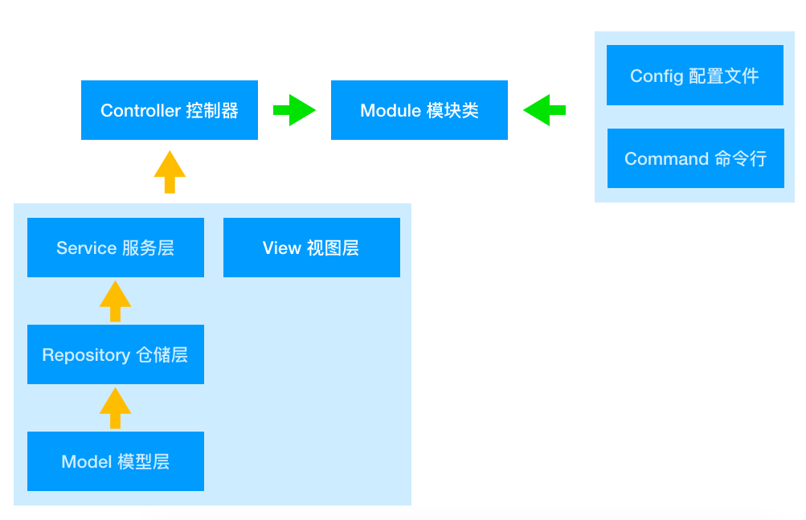

# YII2 模块分层使用(推荐)

## 目录结构

```
|-- commands 命令行脚本
|-- controllers 控制器
|-- models      模型
|-- repositories 仓储
|-- services    服务层
```


### Repository 仓储层

使用 repository 之后，model 仅当成 ActiveRecord 即可，不要包含资料库逻辑

**优点**
- 将资料库逻辑写在 repository，解决 controller 肥大问题。
- 符合 SOLID 的单一职责原则 : 资料库逻辑写在 repository，没写在 controller。
- 符合 SOLID 的依赖反转原则 : controller 并非直接相依于 repository，而是将 repository 依赖注入进 controller。

### Service 服务层

- 牵涉到外部行为 : 如发送Email，使用外部API…。
- 使用PHP写的逻辑 : 如根据购买的件数，有不同的折扣。

**存在问题**
- 将牵涉到外部行为的商业逻辑写在 controller，造成 controller 的肥大难以维护。
- 违反 SOLID 的单一职责原则 : 外部行为不应该写在 controller。
- controller 直接相依于外部行为，使得我们无法对 controller 做单元测试。

**优点**
- 将外部行为写在 service，解决 controller 肥大问题。
- 符合 SOLID 的单一职责原则 : 外部行为写在 service，没写在 controller。
- 符合 SOLID 的依赖反转原则 : controller 并非直接相依于 service，而是将 service 依赖注入进 controller。


> **备注**  
> 根据复杂度，一个Model可以拆分成多个Repository  
> Controller 不要直接使用 Repository , 通过注入 Repository 到 Service 层， 调用 Service 来获取 Repository


### commands 命令行

存放命令行，php 运行脚本


## 使用模块

在 `config/web.php` 和 `config/console.php` 中添加下面代码

```
[
    'modules' => [
        'forum' => [
            'class' => 'app\modules\forum\Module',
            // ... 模块其他配置 ...
        ],
    ],
]
```

## 模块之间功能调用

在 Module 中，通过 IOC注入，不用直接调用方法

```
// 开放类服务
Yii::$container->set('forum.UserService', 'app\modules\forum\services\UserService');

// 开放方法服务
Yii::$container->set('forum.UserService.getUserInfo', function($container, $params, $config) {
    return call_user_func_array([Yii::$container->get('app\modules\forum\services\UserService'), 'getUserInfo'], $params);
});    
```

## 参考资料
- [YII2 模块](https://www.yiichina.com/doc/guide/2.0/structure-modules)
- [Laravel 的中大型專案架構](https://oomusou.io/laravel/architecture/)